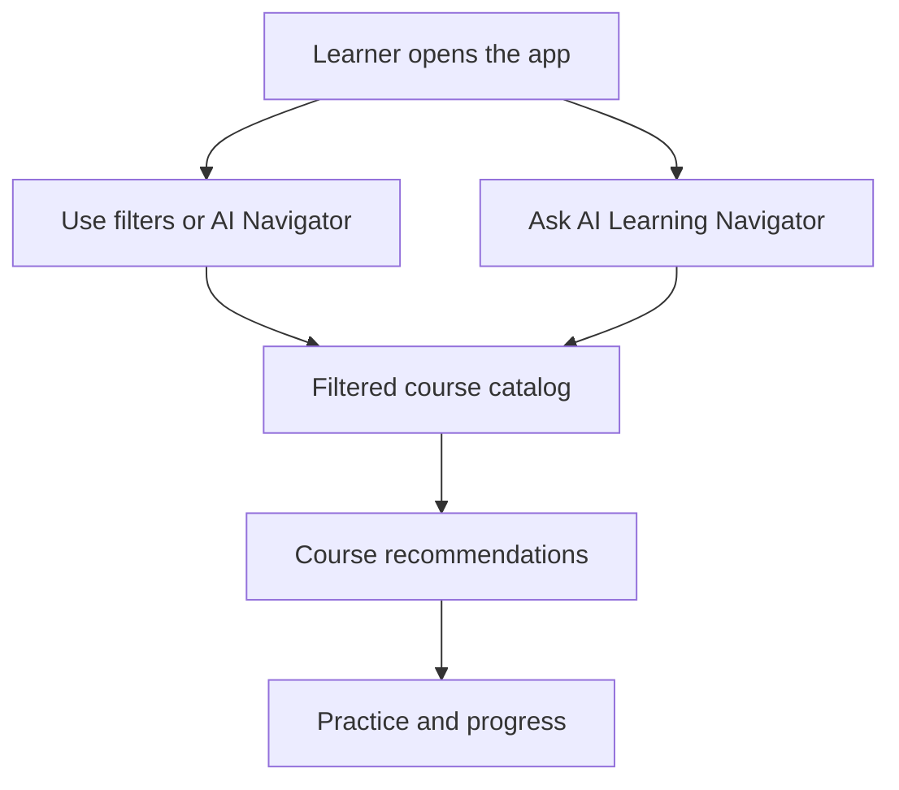
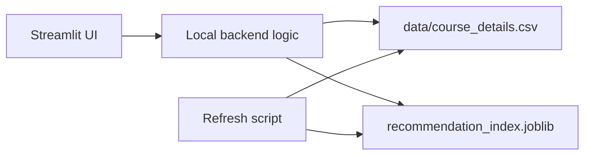
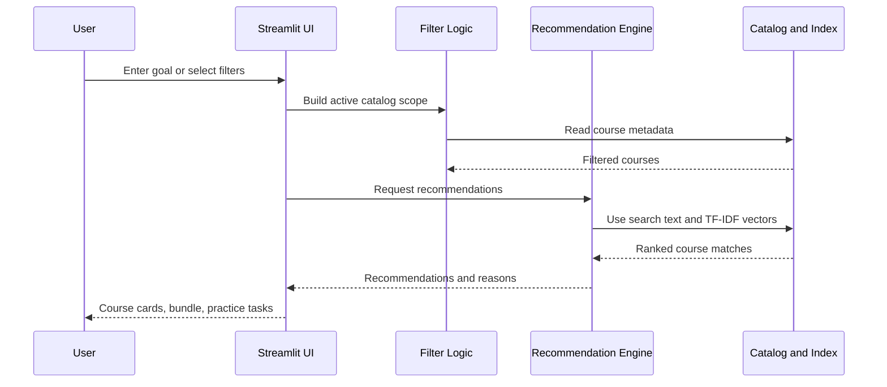

# VRL Learning Navigator

VRL Learning Navigator is a Streamlit web app for goal-based course discovery, learning-roadmap generation, course similarity matching, progress-aware practice, and lightweight practice validation.

The project started as a course recommender, but it now behaves more like a learning guidance system. A learner can search manually, ask the local AI-style navigator for a learning path, compare similar courses, track completed courses, and practice at the right level.

## What It Solves

Online learners often know what they want to become, but not which course to start with or how to continue after finishing one course. This app helps by combining:

- A multi-provider course catalog.
- Manual filters for provider, spoken language, difficulty, organization, skills, and search.
- A local no-API-key learning navigator.
- Similarity-based course recommendations.
- Progress-aware practice tasks.
- Lightweight validation for practice submissions.

## Current Catalog Snapshot

The current catalog contains **4,356 courses**.

| Provider | Courses |
|---|---:|
| Coursera | 3,029 |
| Microsoft Learn | 694 |
| FutureLearn | 386 |
| MIT OpenCourseWare | 230 |
| Kaggle Learn | 17 |

| Spoken Language | Courses |
|---|---:|
| English | 4,259 |
| Arabic | 34 |
| Spanish | 23 |
| Japanese | 20 |
| French | 9 |
| Chinese | 5 |
| Portuguese | 5 |
| Hungarian | 1 |

## Key Features

- **AI Learning Navigator**: Accepts natural-language goals such as "I want a data science roadmap" or "beginner Gen AI courses" and builds a focused learning bundle.
- **Course Similarity**: Lets a user select a completed, liked, or target course and find nearby courses using a TF-IDF similarity index.
- **Progress Tracker**: Tracks completed courses in the session and uses them as a practice anchor.
- **Practice Workspace**: Creates practice tasks based on the active course, difficulty, and skill signals.
- **Practice Validator**: Checks whether a practice submission has enough meaningful evidence against the task rubric.
- **Language Filter**: Detects spoken language from course titles and supports filtering by language.
- **Offline Recommendation Artifacts**: Uses a saved TF-IDF index so the Streamlit app stays fast.
- **No Paid API Required**: The default validator and navigator logic run without API keys.

## User Flow

Full Mermaid source: [documents/user-flow.mmd](documents/user-flow.mmd)



## High-Level Design

Full Mermaid source: [documents/high-level-design.mmd](documents/high-level-design.mmd)

In simple terms, the app has three layers:

- **UI Layer**: Streamlit pages, filters, course cards, navigator chat, practice workspace.
- **Recommendation Layer**: Search filtering, goal matching, course similarity, roadmap grouping, validator logic.
- **Data Layer**: CSV catalog plus precomputed recommendation index.



## Low-Level Design

The Streamlit entrypoint is `app.py`. The application code lives under `src/vrl_learning_navigator/`.

| Area | Main Responsibility |
|---|---|
| `load_courses` | Loads `data/course_details.csv`, fills missing metadata, prepares skill tokens and search text. |
| `render_sidebar` | Renders manual filters, including provider, spoken language, difficulty, organization, and skills. |
| `apply_filters` | Applies the sidebar filter state to the catalog. |
| `recommend_for_goal` | Uses the learner goal and catalog signals to find the best matching courses. |
| `recommend_courses` | Finds similar courses from a selected course using the saved TF-IDF index. |
| `render_advisor_chat` | Renders the AI Learning Navigator chat-like experience. |
| `render_advisor_roadmap` | Builds the learning bundle: start here, practice next, go deeper, resources. |
| `render_progress_tracker` | Tracks completed courses and sets the practice anchor. |
| `validate_practice_attempt` | Scores practice submissions against rubric requirements. |

Full Mermaid source: [documents/low-level-design.mmd](documents/low-level-design.mmd)

### Recommendation Sequence

Full Mermaid source: [documents/recommendation-sequence.mmd](documents/recommendation-sequence.mmd)



## Data Model

The app uses `data/course_details.csv` as the published catalog.

Important columns:

| Column | Purpose |
|---|---|
| `Course Name` | Display title and primary matching signal. |
| `University` | Institution or course owner. |
| `Provider` | Platform such as Coursera, Microsoft Learn, FutureLearn, MIT OCW, or Kaggle Learn. |
| `Language` | Spoken language detected from title signals. |
| `Difficulty Level` | Beginner, Intermediate, Advanced, or Mixed_Difficulty. |
| `Rating` | Course rating when available. |
| `Course URL` | Public link used by Open course buttons. |
| `Course Description` | Course summary used for search and recommendations. |
| `Skills` | Skill keywords used for filters and matching. |
| `Tags` | Expanded searchable text used for recommendations. |
| `Category` | Topic or provider category. |
| `Course Key` | Stable unique key for recommendation artifacts. |
| `Last Verified` | Link verification date when available. |

## Recommendation Logic

The app combines two recommendation styles:

- **Goal-based matching**: The learner describes an outcome. The app interprets provider, difficulty, skills, and domain keywords, then ranks in-scope courses.
- **Course similarity matching**: The learner selects a course. The app compares it with other courses using TF-IDF vectors built from title, description, skills, tags, category, provider, language, organization, and difficulty.

The offline index lives at:

```text
artifacts/recommendation_index.joblib
```

If the saved index is missing or out of date, the app can build a runtime TF-IDF fallback from the CSV.

## Practice Validation

The practice validator is intentionally lightweight and deployable on Streamlit Cloud.

It checks:

- Minimum evidence length.
- Meaningful text variety.
- Plan, evidence, and result sections.
- Semantic overlap with rubric requirements.

Validator configuration:

```text
VRL_VALIDATOR_MODE=free
```

`free` is the default and needs no API key. `smart` can use a stronger local open-source model if the deployment provides the package and resources, but it falls back safely to `free`.

## Project Structure

```text
.
|-- app.py
|-- src/
|   |-- __init__.py
|   `-- vrl_learning_navigator/
|       |-- __init__.py
|       `-- app.py
|-- data/
|   `-- course_details.csv
|-- requirements.txt
|-- README.md
|-- LICENSE
|-- assets/
|   `-- vrl_logo_transparent_sharp.png
|-- documents/
|   |-- user-flow.mmd
|   |-- high-level-design.mmd
|   |-- low-level-design.mmd
|   `-- recommendation-sequence.mmd
|-- artifacts/
|   `-- recommendation_index.joblib
|-- scripts/
|   `-- refresh_catalog.py
`-- .streamlit/
```

## Run Locally

1. Create and activate a Python environment.

```bash
python -m venv .venv
.venv\Scripts\activate
```

2. Install dependencies.

```bash
pip install -r requirements.txt
```

3. Start the app.

```bash
streamlit run app.py
```

The app will be available at:

```text
http://localhost:8501
```

## Streamlit Cloud Deployment

Use these settings:

| Setting | Value |
|---|---|
| Main file | `app.py` |
| Python dependencies | `requirements.txt` |
| Secrets required | None |
| Default validator | `VRL_VALIDATOR_MODE=free` |

No paid API key is required for the default app.

## Catalog Refresh

The refresh pipeline is offline and separate from the Streamlit runtime.

```bash
python scripts/refresh_catalog.py
```

The script is responsible for:

- Collecting public course records.
- Normalizing fields into the app schema.
- Detecting spoken language from title signals.
- Validating links.
- Deduplicating records.
- Rebuilding the TF-IDF recommendation index.
- Writing local quarantine/report files under `reports/`.

## Design Principles Used

- **Single Responsibility**: UI rendering, filtering, recommendation, validation, and refresh logic are separated.
- **Open/Closed**: More course providers can be added through the refresh pipeline without rewriting the UI.
- **Liskov Substitution**: Recommendation artifacts have a runtime fallback when the precomputed index is unavailable.
- **Interface Segregation**: The app uses small focused functions instead of one large controller.
- **Dependency Inversion**: Streamlit renders from normalized catalog data and recommendation artifacts instead of scraping live pages at runtime.
- **DRY**: Common helpers are reused for filtering, labels, language detection, and matching.

## Future Improvements

- Add authenticated user accounts for persistent progress.
- Add richer language metadata from provider pages where available.
- Add more provider adapters behind the same catalog schema.
- Add optional local embedding model support for stronger semantic matching.
- Add screenshots and deployment badge after the showcase repository is created.
